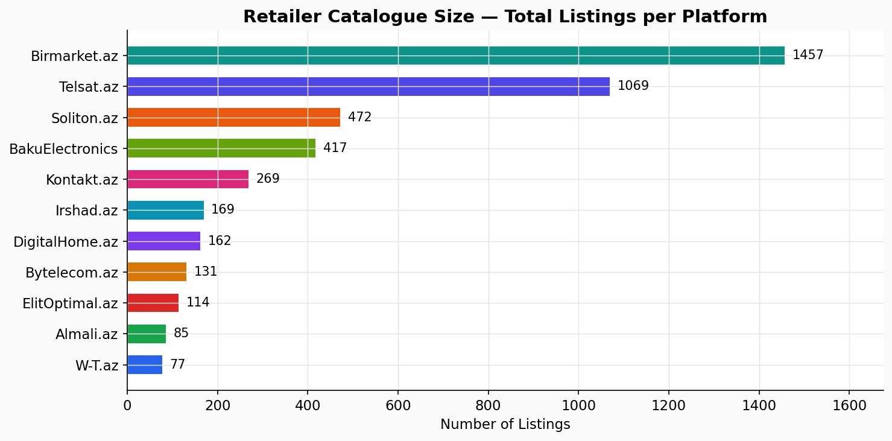
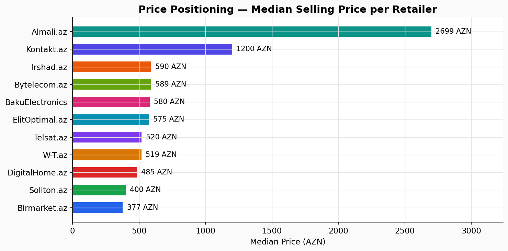
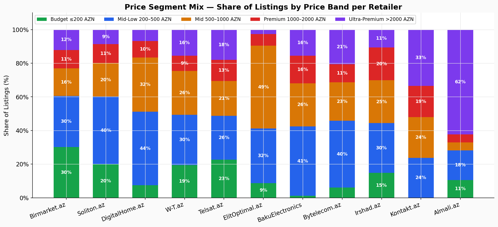
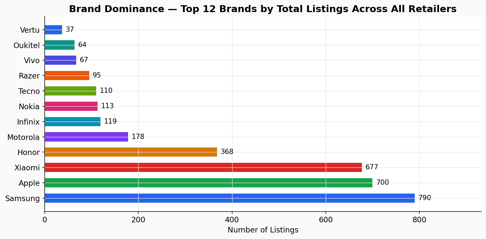
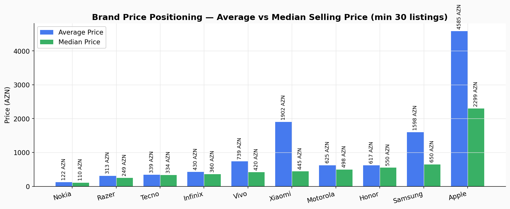
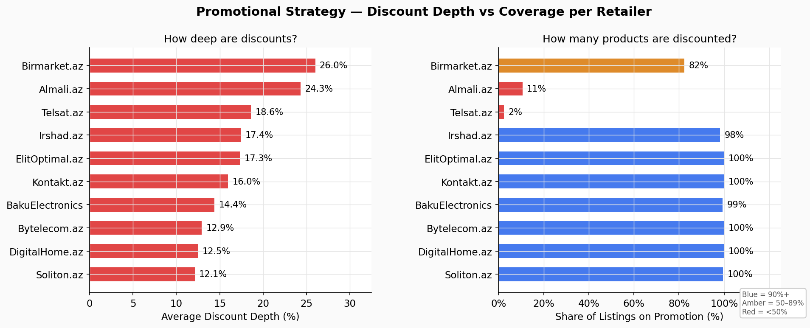
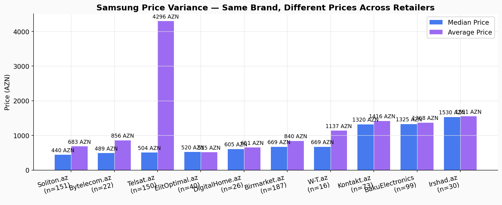
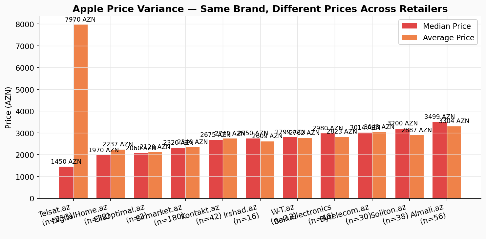
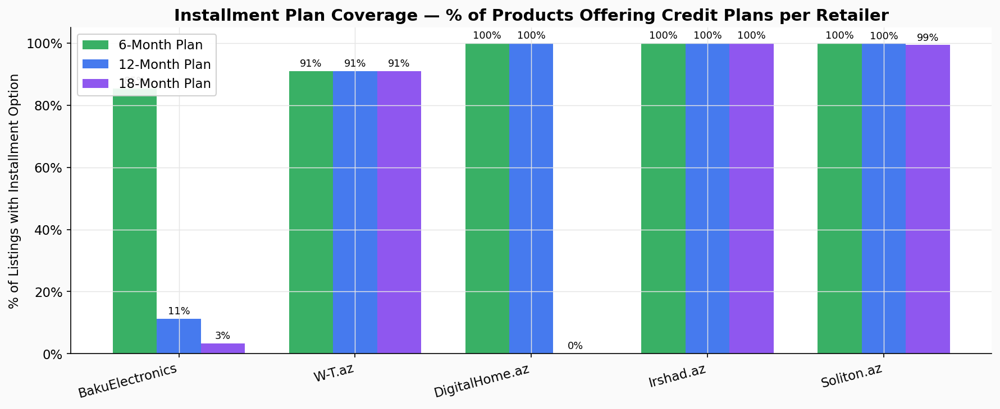
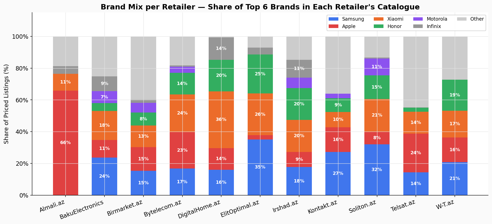

# Azerbaijan Smartphone Market — Competitive Intelligence Report

> **Data snapshot:** February 2026 · 4,422 listings · 11 retailers · currency AZN

---

## Executive Summary

This report analyses the smartphone retail landscape across 11 major Azerbaijani online platforms. The findings reveal a market with sharp differences in pricing strategy, product mix, and promotional aggression — creating both competitive risks and commercial opportunities for any player operating in this space.

**Three headline findings:**

1. **Pricing for the same phone varies by up to 3× across retailers.** A Samsung device priced at 440 AZN on one platform sells for 1,325 AZN on another. Shoppers who compare prices capture enormous savings; retailers who price without market awareness lose sales.
2. **Birmarket and Telsat together account for 57% of all listings**, yet use fundamentally different strategies — Birmarket is discount-driven (avg 26% off), Telsat is almost entirely full-price.
3. **Apple is the highest-revenue brand per unit**, with a median price of 2,300 AZN — four times the market median of ~520 AZN — yet its prices vary by 120% across platforms, suggesting significant unmanaged price erosion.

---

## 1. Who Has the Largest Catalogue?

**What the chart shows:** The number of smartphone listings each retailer currently carries.

**Key findings:**
- **Birmarket.az (1,457 listings)** and **Telsat.az (1,069)** are the volume leaders, together representing 57% of all tracked listings. Their breadth gives consumers — and competitors — the widest selection.
- **Soliton.az (472)** and **BakuElectronics (417)** occupy a strong mid-tier position.
- **Almali.az (85) and W-T.az (77)** operate as curated, niche stores — a deliberate choice reflected in their premium pricing (see Section 2).

**Why it matters:** A larger catalogue signals greater market exposure and a wider net for capturing purchase intent. However, volume alone does not equal profitability — the price positioning story tells a very different tale.

---

## 2. Price Positioning — Who Competes Where?

**What the chart shows:** The median (typical) selling price on each platform — the best single measure of where a retailer sits in the market.

**Key findings:**

| Retailer | Median Price | Market Tier |
|---|---|---|
| Almali.az | 2,699 AZN | Ultra-Premium |
| Kontakt.az | 1,200 AZN | Premium |
| BakuElectronics | 580 AZN | Mid-Market |
| Irshad.az | 590 AZN | Mid-Market |
| W-T.az | 519 AZN | Mid-Market |
| Telsat.az | 520 AZN | Mid-Market |
| Bytelecom.az | 589 AZN | Mid-Market |
| Elitoptimal.az | 575 AZN | Mid-Market |
| Digitalhome.az | 485 AZN | Mid-Market |
| Soliton.az | 400 AZN | Value |
| Birmarket.az | 377 AZN | Value |

**Why it matters:** There are effectively three market tiers. The **Ultra-Premium tier** (Almali, Kontakt) competes on brand and service, not price. The **crowded Mid-Market** has seven retailers within a 200 AZN range of each other — margins here are under constant pressure. The **Value tier** (Soliton, Birmarket) competes on volume and discounting.

---

## 3. What Price Bands Do Retailers Target?

**What the chart shows:** The share of each retailer's catalogue that falls in each price band — from Budget (under 200 AZN) to Ultra-Premium (over 2,000 AZN).

**Key findings:**
- **Birmarket and Telsat** carry the highest share of Budget products (24–30%), signalling a deliberate play for first-time buyers and price-sensitive consumers.
- **Kontakt.az** is the only retailer where Ultra-Premium products (>2,000 AZN) represent the largest single segment (33%), confirming its premium positioning.
- **BakuElectronics** has the best-balanced portfolio across all price bands, giving it resilience across consumer segments.
- **Almali.az** is almost entirely Premium and Ultra-Premium — it carries very few devices under 500 AZN.
- **DigitalHome.az** has zero Ultra-Premium listings, capping its addressable market at the 1,000 AZN price ceiling.

**Why it matters:** Retailers with a narrow price band focus (Almali, DigitalHome) are more exposed to demand shocks in their target segment. BakuElectronics' balanced mix is a structural advantage in a volatile market.

---

## 4. Which Brands Dominate the Market?

**What the chart shows:** The 12 most-listed smartphone brands across all platforms.

**Key findings:**
- **Samsung (794 listings)** leads by volume, appearing across every retailer and every price tier.
- **Xiaomi (592)** is the volume runner-up and the dominant choice in the value segment.
- **Apple (555)** is third by listing count but first by revenue potential — its average price per unit is roughly 8× that of a Nokia or Infinix.
- **Honor (355)** has emerged as a significant mid-market force, likely benefiting from Huawei's withdrawal from the premium segment.
- Budget brands — **Nokia, Infinix, Tecno** — show healthy volumes, confirming strong demand in the under-200 AZN tier.

---

## 5. Brand Price Positioning — Premium vs Value

**What the chart shows:** For each major brand, the average and median selling price across all platforms.

**Key findings:**
- **Apple's median price (2,300 AZN)** is more than four times the next-closest brand. The large gap between Apple's average (~5,200 AZN) and median (2,300 AZN) indicates that a small number of very high-end models (iPhone 16 Pro Max, etc.) pull the average up significantly.
- **Samsung's wide spread** (median 643 AZN, average 1,593 AZN) reflects its unusually broad product range — from entry-level Galaxy A-series to flagship Galaxy S-series.
- **Honor, Motorola, and Vivo** cluster tightly in the 400–700 AZN median range, making them direct competitors in the mid-market.
- **Nokia's median price of ~110 AZN** positions it purely as a feature phone / basic smartphone brand.

**Why it matters:** Brands with wide price ranges (Samsung, Apple) require retailers to make deliberate selection decisions. Stocking only the premium end locks out volume; stocking only the value end damages brand perception.

---

## 6. Discount Strategy — Who Cuts Deepest?

**What the chart shows:** For each retailer, the average depth of discounts (how much they cut prices) and the proportion of their catalogue on promotion at any given time.

**Key findings:**
- **BakuElectronics, Digitalhome, Bytelecom, and Soliton** all run near-100% discount coverage — meaning virtually every product is shown with a crossed-out original price. This is a systematic promotional pricing model, not event-driven discounting.
- **Birmarket (82% coverage, 26% avg discount)** combines high coverage with the deepest cuts on average — the most aggressive promotional stance in the market.
- **Almali.az** shows only 11% of products discounted, with a 24% average cut — selective, deep promotions rather than blanket discounting.
- **Telsat.az** is the outlier: only 2% of its listings carry a discount. It is fundamentally a full-price marketplace, which stands out in a heavily promotional market.
- **W-T.az** shows zero discount coverage — every product is listed at a single price.

**Why it matters:** Blanket discounting trains consumers to wait for promotions and erodes perceived value. Retailers running 100% discount coverage risk being seen as permanently "on sale," undermining full-price credibility. Telsat's full-price model is a contrarian bet on trust and convenience over price.

---

## 7. Samsung: The Same Phone at Very Different Prices

**What the chart shows:** The median and average price for Samsung phones on each platform.

**Key findings:**
- **Soliton.az** has a Samsung median of **440 AZN** — the cheapest in the market. It focuses on entry-level Samsung Galaxy A-series.
- **BakuElectronics (1,325 AZN)** and **Irshad.az (1,530 AZN)** sit at the premium end, skewing towards Galaxy S-series and flagship models.
- **Telsat.az and Birmarket** both hover around 500–670 AZN, confirming their mid-to-value Samsung positioning.
- The gap between the cheapest (440 AZN, Soliton) and most expensive (1,530 AZN, Irshad) median Samsung price is **3.5×** — for the same brand.

**Why it matters:** This is not price gouging — it reflects genuinely different model mixes. However, it signals that no single retailer owns the Samsung customer across all budget levels. A consumer buying their first Galaxy goes to Soliton or Birmarket; upgrading to a flagship takes them to BakuElectronics or Irshad. Retailers should clarify which Samsung segment they are serving.

---

## 8. Apple: Even Wider Price Gaps

**What the chart shows:** The median and average price for Apple iPhones on each platform.

**Key findings:**
- **Telsat.az** has an Apple median of **1,590 AZN** — significantly below all other retailers. With 217 Apple listings, it appears to carry a large volume of older iPhone models or second-hand/refurbished units.
- **Almali.az (3,499 AZN median)** is the clear premium Apple destination — stocking primarily current-generation flagship devices.
- **W-T.az, Kontakt.az, and BakuElectronics** form a premium cluster between 2,700–2,980 AZN, suggesting alignment on current-model pricing.
- The spread from Telsat (1,590 AZN) to Almali (3,499 AZN) is a **120% price difference** for the Apple brand.

**Why it matters:** Consumers searching for "iPhone" see dramatically different prices depending on which platform they visit first. This creates a significant price-discovery opportunity for comparison platforms and a trust risk for retailers at the higher end who are not clearly differentiating on model generation or condition.

---

## 9. Price Spread — How Concentrated Is Each Retailer's Range?

**What the chart shows:** The full distribution of prices on each platform. The box covers the middle 50% of listings; the line inside is the median; dots are outliers.

**Key findings:**
- **Almali.az** has the tightest, highest distribution — concentrated in a narrow Premium/Ultra-Premium band. This reflects its curated, specialist positioning.
- **Birmarket and Telsat** have the widest spreads, stretching from under 50 AZN to over 5,000 AZN — marketplace breadth over editorial curation.
- **Kontakt.az** shows the highest concentration of outliers above 5,000 AZN, confirming its role as the market's premium endpoint.
- **Soliton and DigitalHome** have tight, low distributions with few outliers — disciplined value-market focus.

**Why it matters:** A wide price distribution creates consumer confusion and increases support costs (returns, complaints). Retailers with tight distributions tend to attract more confident, mission-driven buyers. The choice between breadth and focus is a fundamental strategic decision.

---

## 10. Installment Plans — A Key Competitive Lever

**What the chart shows:** The percentage of each retailer's catalogue offering 6-month, 12-month, and 18-month installment payment plans.

**Key findings:**
- **Irshad.az, Digitalhome, and Soliton** offer the most comprehensive installment coverage — nearly 100% of their products carry credit options across all three plan lengths.
- **BakuElectronics** offers installment data on all products, though only one plan length per product.
- **Birmarket, Telsat, Almali, and W-T.az** show no installment plan data — either they do not offer credit or it is not surfaced in the product listing.
- The **18-month plan** is the most common longest-term option, appearing across all retailers that offer credit.

**Why it matters:** In a market where the median phone costs 520 AZN and a flagship costs 3,000+ AZN, installment plans are a direct conversion driver. Retailers without visible credit options are likely losing sales to competitors who offer 18-month financing on the same device. The 18-month plan at ~120 AZN/month makes a 2,200 AZN iPhone accessible to a much wider audience.

---

## 11. Brand Mix — What Does Each Retailer Actually Sell?

**What the chart shows:** The proportion of each retailer's catalogue made up by the top 6 brands — Samsung, Apple, Xiaomi, Honor, Motorola, and Nokia.

**Key findings:**
- **Almali.az** is overwhelmingly Apple-focused (65%+ of its catalogue). It is functionally an Apple specialist.
- **Irshad.az and BakuElectronics** carry the most balanced brand portfolios, with healthy representation across Samsung, Apple, and Xiaomi.
- **Kontakt.az** leans heavily Samsung and Apple — two brands that justify its premium price positioning.
- **Soliton.az and Digitalhome** show a large "Other" share, reflecting their focus on value-tier brands (Infinix, Tecno, ZTE, Oukitel) not captured in the top 6.
- **Telsat.az** has significant Samsung and Apple volume but also the most diverse long tail — consistent with its role as a high-volume marketplace.

**Why it matters:** Over-indexing on a single brand creates supplier dependency risk. Almali's near-total Apple reliance means any Apple supply constraint, pricing change, or demand shift will have an outsized impact on its business. BakuElectronics' diversification is a structural hedge.

---

## Strategic Recommendations

### For Retailers

| Observation | Recommended Action |
|---|---|
| Samsung prices vary 3.5× across platforms | Clearly define which Samsung tier you serve; avoid competing with volume players on entry models if you stock flagship |
| 7 retailers compete in the 400–600 AZN median band | Differentiate on service, installment terms, or brand curation rather than price alone |
| Installment plans drive conversion | Retailers currently showing no installment options (Birmarket, Telsat) should consider surfacing credit offers at the listing level |
| Blanket 100% "discount" displays undermine credibility | Move toward time-limited or event-driven promotions rather than permanent crossed-out prices |
| Apple price gap (1,590 vs 3,499 AZN) creates consumer confusion | Retailers should clearly signal whether they carry current-generation vs older/refurbished Apple devices |

### For Market Entrants

- The **Mid-Market (500–1,000 AZN) is the most contested** segment, with 7 retailers competing directly. Entry here requires a clear differentiator.
- The **Value-plus segment (200–500 AZN)** offers the highest listing volumes and fastest turnover; brand diversity is key.
- **Installment financing** is an underused advantage — a new entrant offering transparent, accessible credit on a well-curated catalogue could rapidly gain market share.

---

## Data Coverage

| Retailer | Listings | Data Collected |
|---|---|---|
| Birmarket.az | 1,457 | February 2026 |
| Telsat.az | 1,069 | February 2026 |
| Soliton.az | 472 | February 2026 |
| BakuElectronics | 417 | February 2026 |
| Kontakt.az | 269 | February 2026 |
| Irshad.az | 169 | February 2026 |
| Digitalhome.az | 162 | February 2026 |
| Bytelecom.az | 131 | February 2026 |
| Elitoptimal.az | 114 | February 2026 |
| Almali.az | 85 | February 2026 |
| W-T.az | 77 | February 2026 |
| **Total** | **4,422** | |

All prices in Azerbaijani Manat (AZN). Analysis covers smartphones and mobile phones only.
